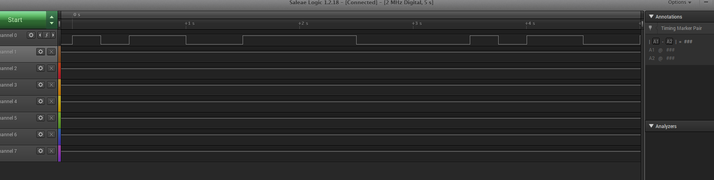
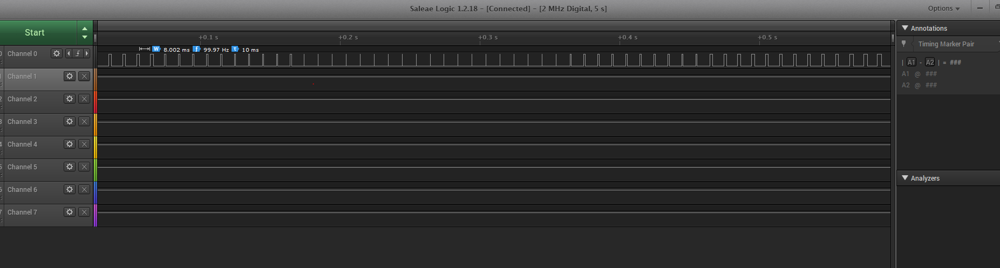
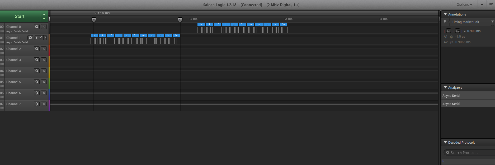
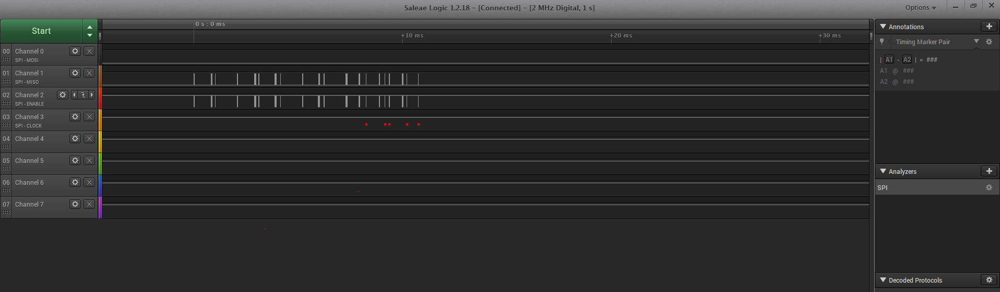

Name:

EID:

Team Number:

## Questions

1. Why does your program need a setup and a loop?

    Setup() is whats run in the beginning and it serves a similar purpose to a main() function. Loop
    is ran continuosly. 

2. What is the downside to putting all your code in a loop?

    The more code in loop, the slowing the program will be.

3. Why does your code need to be compiled?

    It needs to be converted into assembly and machine code.

4. When lowering the frequency in procedure A, step 4, what is going wrong? Brainstorm some solutions. Dimmers exist in the real world. What is their solution?

    The led starts rapidly blinking. Keep the frequency high. Maybe lower voltage?

5. Why do you need to connect the logic analyzer ground to the ESP32 ground?

    It has to share the same ground as the other components.

6. What is the difference between synchronous and asynchronous communication?

    Synchronous communication uses 2 signals, one begin a ready indicator, the other being the bits. Asynchronous communication uses 1 signal and uses another method to figure out the bit rate.

7. Profile of UART: Sent X bytes in Y time 

    10 bytes in .908ms.

8. Profile of SPI: Sent X bytes in Y time

    10 bytes in .2825ms.

9. Why is SPI so much faster than UART?

    SPI is synchronous and uses a master-slave method for communcation.

10. list one pro and one con of UART

    UART requires only 2 wires but is slower.

11. list one pro and one con of SPI

    SPI is fast, doesn't use much board space, but it does not have means for flow control. 

12. list one pro and one con of I2C

    Simple addressing, but slow communication.

13. Why does I2C need external resistors to work?

    Incorrect values can lead to signal loss, so the value is pulled up if not driven low.

## Screenshots

Procedure A, step 1:

Procedure A, step 4:

Procedure B, UART:

Procedure B, SPI:

